# 2021-Summer-Hanssem

**[Android&iOS ARViewer 구축 및 안정화]**  
Android application Stabilization / iOS application build&Stabilization<br>


## 📱 Application Operation Screen
### 🔯 Android Application Operation Screen
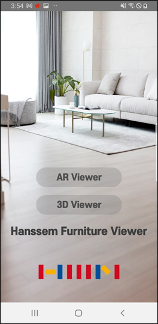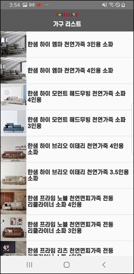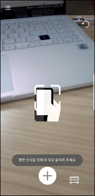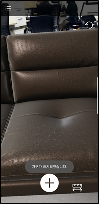<br>
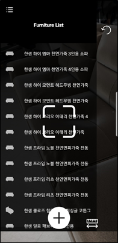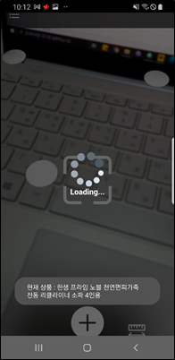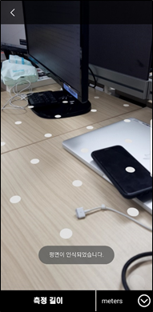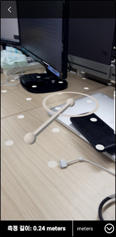<br>

### 🍎 iOS Application Operation Screen
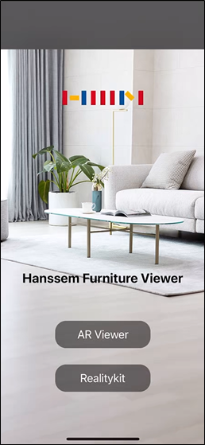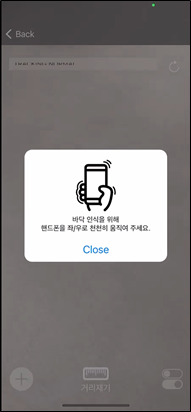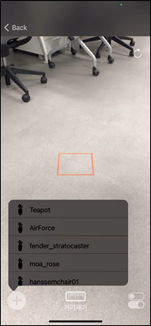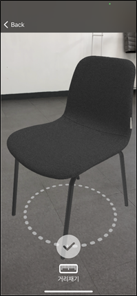<br>
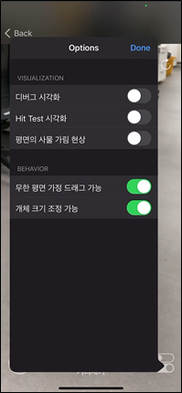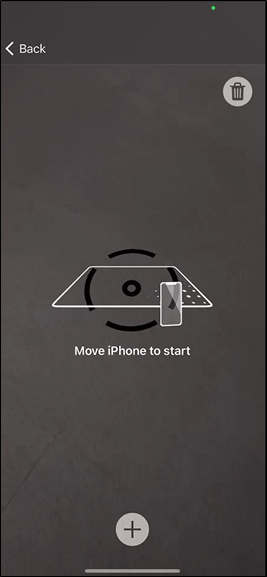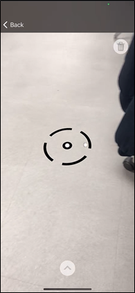<br><br>


## ▶ Application Flow
### Android Flow
<br>
### iOS Flow
<br><br>


### ‼ Installing 

```

```

## Running the tests 


```

```

### Test case

```

```

## Deployment 

Add additional notes about how to deploy this on a live system 


## 🤝🏻Acknowledgments

* [HanssemLink](https://github.com/ddllttmmddwwnnAccount)
