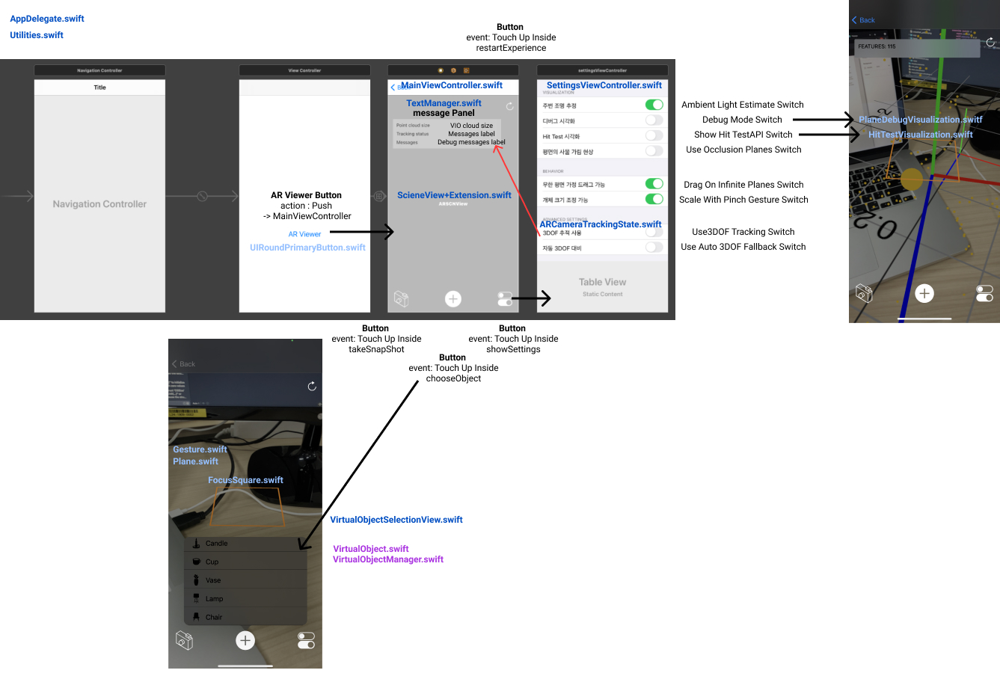
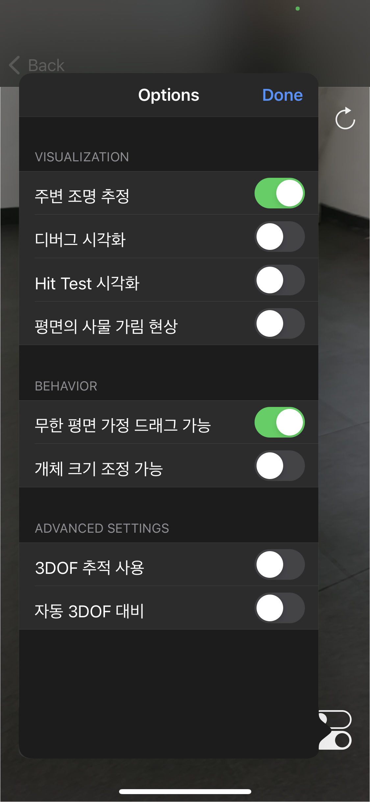
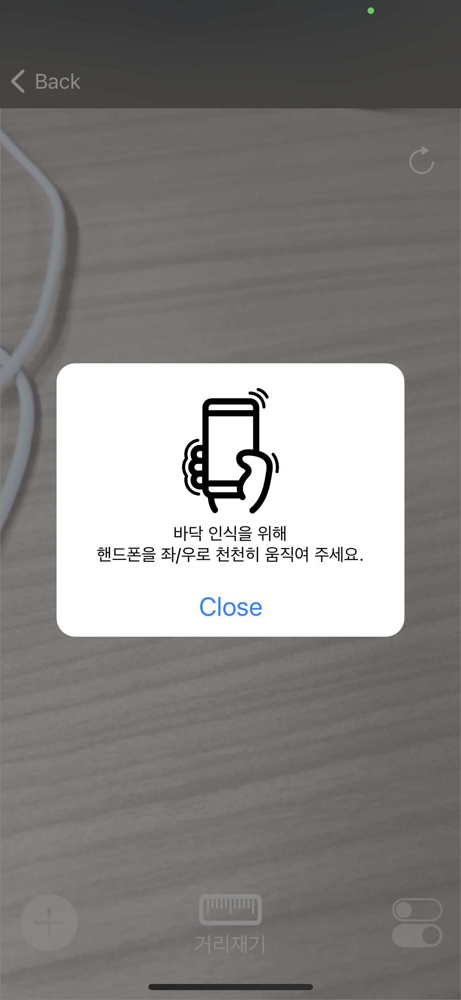
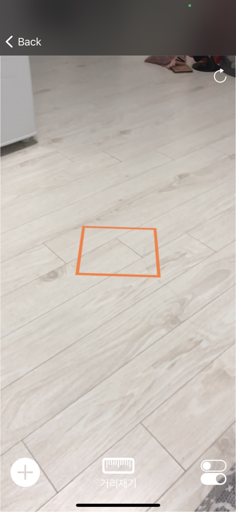

# 2021-Summer-Hanssem

**[Android&iOS ARViewer 구축 및 안정화]**  
Android application Stabilization / iOS application build&Stabilization

## Application Operation Screen
   <br>
   


## Application Flow
### Android Flow

### iOS Flow


### Installing 

```

```

## Running the tests 


```

```

### Test case

```

```

## Deployment 

Add additional notes about how to deploy this on a live system 


## 🤝🏻Acknowledgments

* [HanssemLink](https://github.com/ddllttmmddwwnnAccount)
